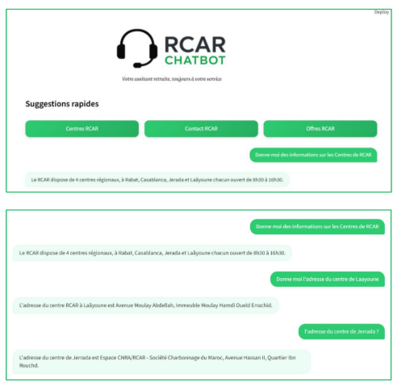

# RCAR Chatbot

Intelligent chatbot based on the **RAG (Retrieval-Augmented Generation)** approach to answer questions about the **Régime Collectif d’Allocation de Retraite (RCAR)**.  
This project was developed as part of an internship at **CDG (Caisse de Dépôt et de Gestion)**.
---

## Features

- Answer questions about RCAR: rules, centers, contacts, offers.
- Contextual search using **VectorDB (FAISS)**.
- Interactive user interface with **Streamlit**.
- Quick suggestions for frequent questions.
- Multi-language support: French, English, Arabic.

---
## Architecture

The chatbot follows a **RAG (Retrieval-Augmented Generation)** pipeline:

1. User submits a query via the interface  
2. Query is converted into embeddings  
3. Semantic search is performed in the Vector Database (FAISS)  
4. Relevant documents are retrieved  
5. LLM (Mistral) generates a contextual response  
6. Response is displayed to the user

--- 

## Project Structure

RCAR-Chatbot/

│

├── README.md

├── SETUP.md 

├── requirements.txt

├── .gitignore

├── .env.example

├── ui_version.py

├── rag.ipynb

├── data/ 

├── assets/ 

└── chatbot/ 

- **SETUP.md** Instructions d'installation et exécution
- **data/**: CSV files 
- **assets/** Logos and images 
- **chatbot/**: Python scripts for LLM configuration, VectorDB creation, and chatbot queries. (BACKEND)
- **ui_version.py**: Streamlit interface.  
- **rag.ipynb**: Notebook for experiments and testing.  
- **assets/**: Images and logos used in the interface.  

---

## Data

All CSV files included contain only public information from RCAR/CDG (centers, contacts, offers, news).
No personal or sensitive information is included.

---

## Tech Stack

- **Python**
- **Streamlit** – Web interface
- **LangChain** – RAG pipeline orchestration
- **FAISS** – Vector database
- **HuggingFace Embeddings**
- **Mistral LLM**
- **Pandas** – Data processing
- **BeautifulSoup / Requests** – Web scraping
---

## Preview

---
## Results

- The chatbot provides **accurate and contextual answers** for RCAR-related queries.
- Performs well on:
  - Centers and contact information
  - Eligibility rules
  - General RCAR information
- Limitations:
  - Possible hallucinations when information is missing
  - No conversational memory (stateless interactions)
  - Depends on the quality and completeness of the dataset

This highlights the importance of prompt design and data coverage.

--- 
## Future Improvements

- Add conversational memory
- Improve prompt engineering
- Mobile version of the chatbot
- Export conversations (PDF/DOCX)
- Voice interaction support

---

## Disclaimer

This project was developed as part of an internship at **CDG (Caisse de Dépôt et de Gestion)**.

It is based on publicly available data and is shared for educational and demonstration purposes only.

No confidential or proprietary information is included.
